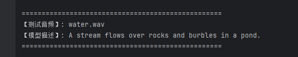
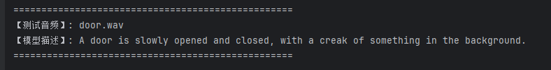
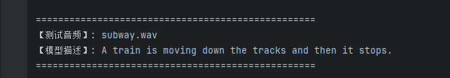

# mini-ALM: 能听得懂声音的大模型

现在很多 VLM (Vision Language Model) 模型给模型加上了“眼镜”，但是在声学这一块研究还不算很多。因此，作者想搞一个最小化的 ALM (Audio Language Model)，给模型加上“耳朵”。

不过图片和声音这两个信息载体的结构不同，图片没有时间信息，而音频有时间信息。如果直接按照处理图片的方式，从大模型端接受信息的角度看，所有的信息都失去了时间层面的信息，都杂糅在了一起。

所以在构造转换层的时候必须十分小心。特征维度非常高且长度较长，但是 GPT-2 处理长序列效率很低，如果直接处理完可能会直接爆掉。我们需要平滑处理信息同时不能丢失信息细节，因此引入了 **Q-Former**。
作为一个桥梁保留最原本的信息。

### 核心机制

为了保留时间顺序信息，我们在音频特征上加入时间位置编码 `audio_pos`，使模型能够区分不同时间段的声音事件。

使用一组可学习的 `query tokens`，通过 `cross-attention` 从音频特征序列中提取关键信息，并将长序列音频特征压缩为固定数量的表示向量。

同时，每个 `query` 也加入 `query_pos`，为不同 `query` 提供唯一身份，使其学习不同的信息提取模式，从而形成一组信息槽（information slots），对音频序列进行结构化压缩。

### 处理流程

```text
audio_features [B,64,768]
      +
audio_pos
      ↓
带时间信息的 audio tokens

queries [32]
      +
query_pos
      ↓
带身份信息的 queries

queries  --cross attention--> audio_features
      ↓
query_outputs [B,32,768]
      ↓
proj + norm
```

然后将最后的序列交给 GPT 即可。

### 数据集与实现细节

数据集使用 **CLAPv2/Clotho**。这里 `dataset` 会抽风，会强制调用 `torchaudio` 处理，但是 Bug 很多。所以建议从 HuggingFace 下载后，转成“音频一个文件夹，文字一个文件夹”的格式。

### 启动方式

*   训练模型：`python train.py`
*   进行推理：`python chat.py`

### 描述展示
####  能正常听到并描述声音

#### 能察觉到时间层面先听到的声音

#### 能根据声音的变化来推断具体物理情况（远到近并且停下来）

